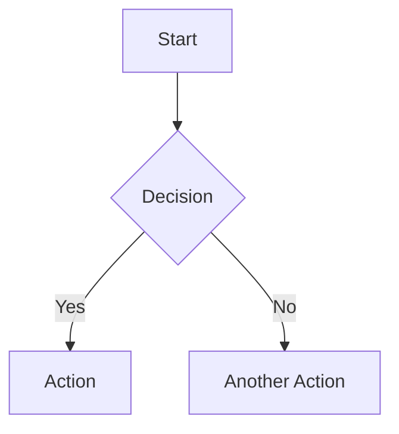

# PasteDown - Markdown Paste Service


PasteDown is a modern, distraction-free Markdown paste service where users can create and share Markdown content via unique URLs. It offers real-time previewing with enhanced Markdown support including math equations (KaTeX) and diagrams (Mermaid).

## ✨ Features

- **Distraction-Free Editing**: Clean, minimal interface for writing Markdown content
- **Live Preview**: Real-time preview of your Markdown as you type, with synchronized scrolling
- **Enhanced Markdown Support**:
  - Math equations via KaTeX
  - Diagrams via Mermaid
  - SmartyPants typography for smart quotes and dashes
- **Responsive Design**: Optimized for both desktop and mobile devices
- **Unique URLs**: Each paste gets a short, unique URL for easy sharing
- **Auto-Expiration**: Pastes automatically expire after 3 days
- **Rate Limiting**: Protection against abuse (5 requests per hour per IP)
- **Dark/Light Mode**: Toggle between dark and light themes

## 🚀 Tech Stack

- **Framework**: [Next.js 14](https://nextjs.org/) (App Router)
- **Styling**: [Tailwind CSS](https://tailwindcss.com/)
- **UI Components**: [shadcn/ui](https://ui.shadcn.com/)
- **Markdown Rendering**: [React Markdown](https://github.com/remarkjs/react-markdown)
- **Math Rendering**: [KaTeX](https://katex.org/) via rehype-katex
- **Diagram Rendering**: [Mermaid](https://mermaid.js.org/) via remark-mermaid-plugin
- **ID Generation**: [nanoid](https://github.com/ai/nanoid)
- **Animations**: [Framer Motion](https://www.framer.com/motion/)
- **Form Handling**: [React Hook Form](https://react-hook-form.com/)
- **Validation**: [Zod](https://zod.dev/)
- **Notifications**: [Sonner](https://sonner.emilkowal.ski/)

## 🛠️ Getting Started

### Prerequisites

- Node.js (v20+ recommended)
- npm, yarn, or pnpm

### Installation

1. Clone the repository:

   ```bash
   git clone https://github.com/adhishthite/PasteDown.git
   cd PasteDown
   ```

2. Install dependencies:

   ```bash
   npm install
   # or
   yarn install
   # or
   pnpm install
   ```

3. Run the development server:

   ```bash
   npm run dev
   # or
   yarn dev
   # or
   pnpm dev
   ```

4. Open [http://localhost:3000](http://localhost:3000) in your browser to see the app.

## 📝 Usage

### Creating a Paste

1. Visit the landing page at [http://localhost:3000](http://localhost:3000)
2. Type or paste your Markdown content in the editor
3. View the live preview on the right (or switch tabs on mobile)
4. Click "Create Paste" when you're ready to share

### Viewing a Paste

- Visit the paste's unique URL (e.g., `http://localhost:3000/abc123`)
- The Markdown will be rendered as HTML
- Use the buttons to copy the content or share the URL

### Markdown Features

PasteDown supports standard Markdown syntax plus:

````markdown
# Math Equations (KaTeX)

$E = mc^2$

# Diagrams (Mermaid)


````

## 📊 Implementation Details

- Pastes are stored in-memory with simulated TTL for the MVP (would use MongoDB in production)
- Rate limiting is implemented to prevent abuse (5 requests per hour per IP)
- Responsive design adapts to different screen sizes:
  - Desktop: Side-by-side editor and preview
  - Mobile: Tab-based interface to switch between editor and preview
- Synchronized scrolling between editor and preview for better UX

## 🧩 Project Structure

```
PasteDown/
├── app/                   # Next.js App Router pages and API routes
│   ├── [id]/              # Dynamic paste viewing route
│   ├── api/               # API endpoints
│   │   └── paste/         # Paste creation and retrieval
├── components/            # React components
│   ├── ui/                # shadcn/ui components
│   └── ...                # Custom components
├── hooks/                 # Custom React hooks
├── lib/                   # Utility functions
├── public/                # Static assets
├── styles/                # Global styles
└── types/                 # TypeScript type definitions
```

## 🔮 Future Enhancements

- User accounts for paste management
- Custom expiration times
- Private pastes with password protection
- Syntax highlighting for code blocks
- Paste forking/versioning
- Real database integration (MongoDB)

## 📄 License

This project is open source and available under the [MIT License](LICENSE).

## 🙏 Acknowledgments

- [Next.js](https://nextjs.org/) for the React framework
- [TailwindCSS](https://tailwindcss.com/) for the utility-first CSS
- [shadcn/ui](https://ui.shadcn.com/) for the component library
- [React Markdown](https://github.com/remarkjs/react-markdown) for Markdown rendering
- [nanoid](https://github.com/ai/nanoid) for ID generation
- [KaTeX](https://katex.org/) for math equation rendering
- [Mermaid](https://mermaid.js.org/) for diagram rendering
